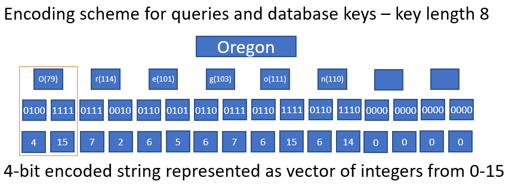
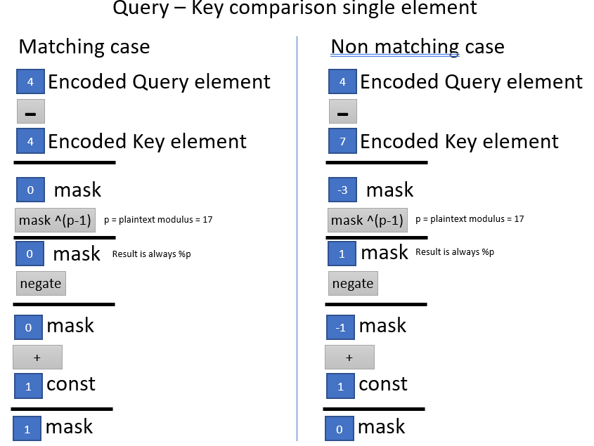
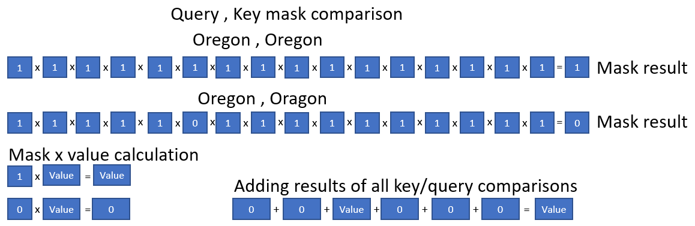

# Secure Query Example

The secure query example is designed to serve as a reference and proof of concept for how the concepts and features of HE can be used to implement a database lookup in which both the database and query are encrypted during the entire lookup.

## Description
The secure query example implements a simple secure database query using the SEAL BFV HE scheme.
It will be built whenever SEAL is enabled as part of the he-toolkit build.
The example consists of 2 component classes and a main file.
 - SQClient implements basic client functionality including initializing the encryption context, key generation, and encrypting and decrypting database queries.
 - SQServer stores the encrypted database and implements the encrypted database query algorithm.
 - Main.cpp Program which creates an instance of SQClient with either default or user specified encryption parameters, an instance of SQServer is then also initialized with the chosen parameters. Next the application reads in a set of key/value pairs from a user specified csv file and encrypts them using the HE context. The user is then prompted to enter a search key and the results of the search are then displayed.

## Usage

To run it execute
```bash
	cd $HE_SAMPLES/build/examples/secure-query
	./secure-query
```
### Example output

The following shows an example of a run of the sample using the default encryption and database file.
```bash
	Initialize SEAL BFV scheme with default parameters[Y(default)|N]:
	SEAL BFV context initialized with following parameters
	Polymodulus degree: 8192
	Plain modulus: 17
	Key length: 8
	Input file to use for database or press enter to use default[us_state_capitals.csv]:
	Number of database entries: 50
	Encrypting database entries into Ciphertexts
	Input key value to use for database query:Oregon
	Querying database for key: Oregon
	Decoded database entry: Salem

	Total query elapsed time(seconds): (Time in seconds for database query)
	Records searched per second: (number of records searched per second)
```

### Default options

The default options are set to allow the demo to work well with the current example dataset. It uses the following parameters
 - Polymodulus degree: 8192
 - Plain Modulus: 17
 - Key length: 8 characters
 - Input database: us_state_capitals.csv (Has 50 entries consisting of key:value (state name : Capital name) First letter capitalized.

### Custom options

The sample also supports specifying custom encryption parameters and input options. This can be useful to test more secure settings as well as to adjust key length to support different database files. The sample uses the default SEAL security level of 128-bits but all security related values should be verified before use in a real application.
The encryption parameters which can be specified are
 - A power-of-two poly modulus degree specified as e.g. "10" for degree 1024=2^10
 - Plain modulus, this must be prime and > than 17
 - Database key length: The key length in characters, shorter keys will be padded with 0 to this length and longer keys will be truncated, should be long enough to fit the longest key specified in the dataset.

Additionally a custom database can be specified. The format of this database has the format (key , value).

## Implementation Details

This section provides additional details on the implementation of the secure query lookup algorithm. It should be used in tandem with the in source 
documentation and provided references. 

### Database key and user query encoding scheme

Each database entry in our sample consists of a key string and value string pair. Keys and user queries are encoded so that we can perform an encrypted
comparison between them and return a keys associated value string when it matches the user query string. The following diagram illustrates how strings are 
decomposed into individual characters and then encoded 4 bits at a time into ciphertexts. For this example we choose 4 bits to encode at a time because that is the largest that can be represented by our coefficients given our plain modulus size of 17 which is a parameter of the lookup comparison algorithm. 



### Key comparison and mask generation using Fermat's Little Theorem

Combining the attribute that our plaintext coefficients exist modulus our plaintext modulus p and the idea presented in fermat's 
little theorem which states that for any integer a that is not a multiple of p, and p is prime, then a^(p-1) = 1 % p, we are able to 
calculated a comparison mask that evaluates to 0 for non matches and 1 for matches. The following diagram illustrates how these 
masks are calculated for each entry of our query and database key.



### Value encoding scheme

Database entry values are encoded in a similar but different and more efficient way than our database keys. For the database values 
the string is split into the same vector of integers with values from [0,15], but instead of encoding 1 integer per ciphertext we are
able to encode all integers into a single ciphertext upto the coefficient count of the ciphertext.

### Results accumulation and return
For each database entry we perform keylength*2 component comparisons generating keylength*2 mask ciphertext results. These masks all contain a value of 0 if the values did not match or 1 if the values were the same. We then multiply all of these results together resulting in a value of 0 if the key and query differ or 1 if they match exactly. This value is then multipled against the value 
ciphertext which results in a ciphertext containing all 0 coefficients for non matches or a ciphertext with coefficients identical to 
the value ciphertext. As all database keys are required to be unique the result of any query can only return 0 or 1 matches, allowing us to safely accumulate the result of all our comparisons into a single ciphertext which is then returned. The value of this ciphertext will
be either 0 which decodes to an empty string for non matches or the value string of the matching key. The following diagram illustrates how these accumulation steps are performed.




## References

[Microsoft SEAL](https://github.com/microsoft/SEAL)

[Fermat's Little Theorem](https://en.wikipedia.org/wiki/Fermat%27s_little_theorem)

[HELib country db lookup sample](https://github.com/homenc/HElib/tree/master/examples/BGV_country_db_lookup)

## Acknowledgements

This database lookup example is a derived port of the BGV Country Lookup example code that ships with [HElib](https://github.com/homenc/HElib) and can be found [here](https://github.com/homenc/HElib/tree/master/examples/BGV_country_db_lookup).
